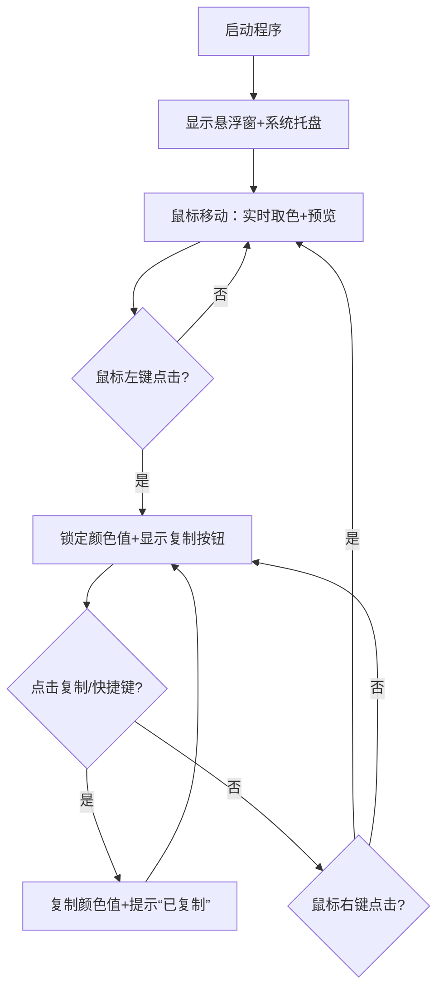

# 吸色器（Color Picker）产品需求文档
## 文档信息
| 项⽬ | 内容 |
|------|------|
| 文档版本 | V1.0 |
| 产品名称 | 轻量吸色器 |
| 目标平台 | Windows/macOS/Linux |
| 开发框架 | Tauri + Rust + Vue3 |
| 文档作者 | - |
| 修订日期 | 2026-03-19 |

## 一、产品概述
### 1.1 产品定位
一款轻量、跨平台、高性能的屏幕吸色工具，支持实时捕获屏幕任意位置像素颜色，提供多格式颜色值转换与一键复制功能，替代传统重量级吸色工具（如Photoshop取色器），满足设计师、开发人员日常取色需求。

### 1.2 核心价值
- 轻量：安装包体积＜10MB，启动速度＜1秒；
- 精准：支持高DPI屏幕，颜色捕获精度100%；
- 便捷：悬浮窗跟随鼠标，一键复制多格式颜色值；
- 跨平台：兼容Windows/macOS/Linux主流系统。

### 1.3 目标用户
- UI/UX设计师：快速获取设计稿/屏幕颜色；
- 前端/客户端开发：直接复制代码可用的颜色格式；
- 普通用户：简单易用的屏幕取色需求。

## 二、功能需求
### 2.1 核心功能
| 功能模块 | 功能点 | 详细描述 |
|----------|--------|----------|
| 屏幕取色 | 实时悬浮取色 | 1. 启动后显示透明悬浮窗（取色光标），跟随鼠标移动； 2. 实时捕获鼠标位置像素颜色，预览颜色值； 3. 悬浮窗支持穿透底层窗口（不影响其他操作）。 |
| | 点击确认取色 | 1. 点击鼠标左键确认取色，锁定当前颜色值； 2. 支持鼠标右键取消锁定，恢复实时取色。 |
| 颜色格式转换 | 基础格式 | 支持RGB（255,255,255）、十六进制（#FFFFFF）格式互转并展示。 |
| | 扩展格式（可选） | 支持HSL（0,0%,100%）、RGBA（255,255,255,1）、CSS变量格式展示。 |
| 颜色复制 | 一键复制 | 1. 点击复制按钮/快捷键（Ctrl/Cmd + C）复制当前选中的颜色值； 2. 默认复制十六进制格式，支持切换复制格式。 |
| | 复制反馈 | 复制成功后显示“已复制”提示，提示持续1秒后自动消失。 |
| 悬浮窗控制 | 窗口置顶 | 悬浮窗始终置顶显示，不受其他窗口遮挡。 |
| | 窗口隐藏/显示 | 1. 快捷键（默认Alt + C）快速隐藏/显示悬浮窗； 2. 点击系统托盘图标也可切换显示状态。 |
| | 窗口大小调整（可选） | 支持拖拽调整悬浮窗/预览框大小。 |

### 2.2 辅助功能
| 功能模块 | 功能点 | 详细描述 |
|----------|--------|----------|
| 系统托盘 | 基础操作 | 1. 程序最小化后驻留系统托盘，不占用任务栏； 2. 托盘菜单支持：显示/隐藏悬浮窗、设置、关于、退出。 |
| 快捷键设置 | 自定义快捷键 | 1. 支持自定义取色确认、复制、显示/隐藏悬浮窗的快捷键； 2. 快捷键冲突时给出提示，默认快捷键可一键恢复。 |
| 颜色历史记录（可选） | 记录最近取色 | 1. 保存最近10条取色记录，支持查看/复制历史颜色； 2. 支持清空历史记录。 |
| 跨平台适配 | 权限申请 | 1. macOS：自动引导用户开启“屏幕录制”权限，无权限时提示并跳转系统设置； 2. Windows/Linux：自动获取屏幕权限，无需手动配置。 |
| | 高DPI适配 | 自动识别屏幕DPI缩放比例，修正取色坐标，避免像素偏移。 |

### 2.3 非功能需求
| 类型 | 要求 | 详细说明 |
|------|------|----------|
| 性能 | 启动速度 | 程序启动时间≤1秒（冷启动）。 |
| | 取色延迟 | 鼠标移动时取色反馈延迟≤10ms，无卡顿。 |
| 兼容性 | 系统版本 | Windows：Win10/11（64位）；macOS：10.15+；Linux：Ubuntu 20.04+/CentOS 8+。 |
| | 屏幕适配 | 支持单/多显示器、高DPI屏幕（2K/4K）。 |
| 易用性 | 操作门槛 | 无需学习成本，启动即可用，核心操作仅需鼠标点击/快捷键。 |
| | 界面设计 | 极简UI，无多余弹窗，悬浮窗仅显示必要的颜色预览和值。 |
| 安全性 | 权限控制 | 仅申请必要权限（屏幕截图、剪贴板、系统托盘），无后台运行、无数据上传。 |
| 体积 | 安装包 | 打包后体积≤10MB（全平台）。 |

## 三、交互设计
### 3.1 核心交互流程

### 3.2 界面布局
1. **悬浮窗**（核心）：
   - 尺寸：默认40×40px，圆形边框，透明背景；
   - 内容：中心显示1px十字线（取色定位），下方显示颜色预览块（16×16px）+ 十六进制颜色值；
   - 样式：鼠标悬浮时无额外样式，点击锁定后边框高亮（#409EFF）。
2. **颜色预览弹窗**（可选）：
   - 触发：锁定颜色后点击悬浮窗；
   - 尺寸：200×120px；
   - 内容：
     - 顶部：大尺寸颜色块（180×60px）；
     - 底部：多格式颜色值展示（RGB/十六进制/HSL）+ 对应复制按钮。
3. **系统托盘菜单**：
   - 菜单项：显示/隐藏悬浮窗、快捷键设置、颜色历史（可选）、关于、退出。

### 3.3 快捷键设计（默认）
| 操作 | 快捷键 | 备注 |
|------|--------|------|
| 显示/隐藏悬浮窗 | Alt + C | 全平台通用 |
| 确认取色 | 鼠标左键 | - |
| 取消锁定 | 鼠标右键 | - |
| 复制颜色值 | Ctrl/Cmd + C | 锁定颜色后生效 |
| 退出程序 | Esc | 仅在悬浮窗显示时生效 |

## 四、异常处理
| 异常场景 | 处理方式 |
|----------|----------|
| macOS无屏幕录制权限 | 1. 弹出提示框：“需要屏幕录制权限才能取色，请前往系统设置开启”； 2. 提示框提供“打开系统设置”按钮，一键跳转； 3. 未开启权限时，悬浮窗显示“无权限”提示，无法取色。 |
| Windows高DPI屏幕像素偏移 | 程序启动时自动检测DPI缩放比例，修正取色坐标，无感知适配。 |
| 剪贴板复制失败 | 弹出提示：“复制失败，请手动复制颜色值”，并高亮显示颜色值。 |
| 多显示器切换 | 自动识别鼠标所在显示器，切换截图源，无感知适配。 |
| 快捷键冲突 | 1. 设置页面提示“快捷键冲突，请修改”； 2. 冲突快捷键无法保存，强制要求修改。 |

## 五、版本规划
### V1.0 核心版本（必做）
- 基础悬浮窗取色功能；
- RGB/十六进制格式转换与复制；
- 系统托盘与基础快捷键；
- 跨平台权限适配（Windows/macOS/Linux）。

### V1.1 增强版本（可选）
- 扩展颜色格式（HSL/RGBA/CSS变量）；
- 自定义快捷键；
- 颜色历史记录；
- 悬浮窗大小/样式自定义。

### V2.0 进阶版本（可选）
- 截图区域取色（框选区域内取色）；
- 颜色对比功能；
- 颜色收藏夹；
- 国际化支持（多语言）。

## 六、验收标准
| 功能点 | 验收标准 |
|--------|----------|
| 实时取色 | 1. 鼠标移动时，悬浮窗颜色值实时更新，延迟≤10ms； 2. 高DPI屏幕（200%缩放）下，取色坐标无偏移，颜色值准确。 |
| 颜色复制 | 1. 点击复制按钮/快捷键，颜色值成功写入剪贴板； 2. 粘贴到文本编辑器中，格式正确无乱码。 |
| 跨平台适配 | 1. Windows 11/macOS 14/Linux Ubuntu 22.04 系统下均可正常启动； 2. macOS 无权限时提示清晰，引导流程顺畅。 |
| 性能 | 1. 冷启动时间≤1秒； 2. 持续运行2小时无内存泄漏、无卡顿。 |
| 体积 | 打包后安装包体积≤10MB（Windows/macOS/Linux）。 |

### 总结
1. **核心目标**：基于Tauri开发轻量、跨平台、精准的屏幕吸色器，核心功能为实时悬浮取色、多格式转换、一键复制；
2. **关键约束**：安装包体积＜10MB、启动速度＜1秒、跨平台适配（重点处理macOS权限和Windows高DPI）；
3. **版本规划**：V1.0实现核心取色/复制功能，V1.1迭代快捷键/历史记录等增强功能，V2.0拓展进阶能力。
